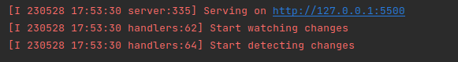
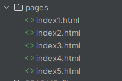
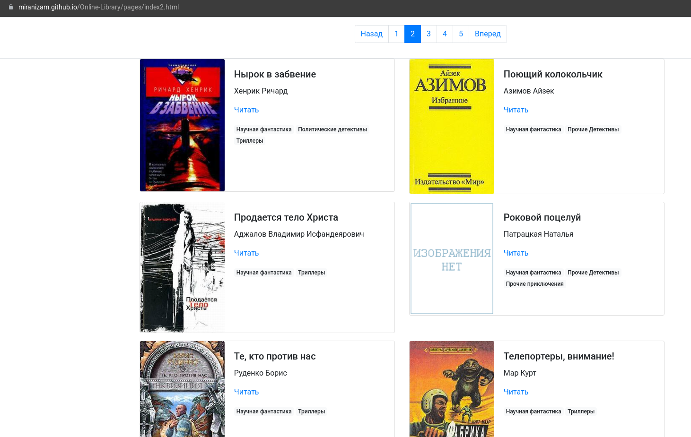
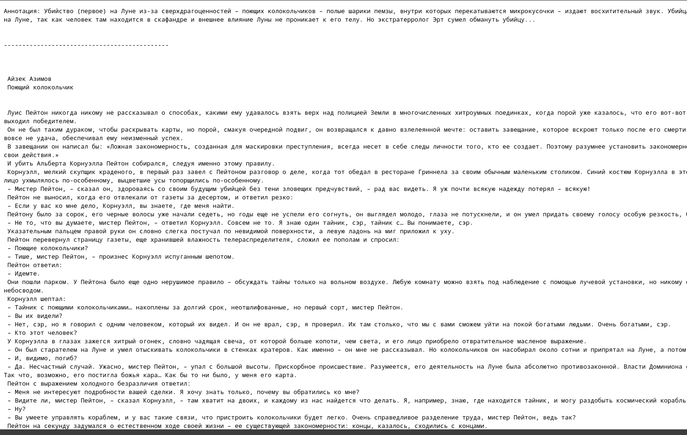

# Online library

What is it? 

Online and also offline library with parser, settings and the site.
The script can download books(files), their descriptions, create your own library with the website. We will do it with with resources the great free online library [tululu.org](tululu.org).

## Let's start:

### Prerequisites

Please be sure that **Python3** is already installed. 

### Installing
1. Clone the repository:
```
git clone https://github.com/MiraNizam/Online-Library.git
```
2. Create a new virtual environment env in the directory
```
python -m virtualenv env
```
3. Activate the new environment
```
source env/bin/activate
``` 
4. Use pip (or pip3, if there is a conflict with Python2) to install dependencies in new environment:
```
pip install -r requirements.txt
```

### How to run code (Part I):
You can parse: range of books, pages or full category.

You should run the script from the folder "Online-Library"

Script has command-line interface for comfortable using. 
Interface includes the following commands: 

for ```main.py```: 

* ```--start_id``` the start position in range for parsing, default: 1
* ```--end_id``` the end position in range for parsing, default: 10

for ```parse_tululu_category.py```:

* ```--start_page```  the start position in range for parsing, default: 1 
* ```--end_page``` the end position in range for parsing, default: the last page in category
* ```--dest_folder``` path to the catalogue with parse result: images and books,  as default: folders named images and books
* ```--skip_imgs``` Don't download images, change to True. Default: False. 
* ```--skip_txt```Don't download txt, change to True. Default: False. 
* ```--json_path``` path to JSON file, as default: media
* ```--help``` use it if you forget the information above

for ```render_website.py```:

* ```--json_path``` path to JSON file, as default: media

Examples:

Parse book in range from 1 to 10
```
python main.py
```
Parse book in range from 11 to 15
```
python main.py --start_id=11 --end_id=15
```
Parse full category
```
python parse_tululu_category.py
```
Parse page **600**, save images and books in folder **page_600**, save .json file in folder **json_file** and skip images
```
python parse_tululu_category.py --start_page 600 --end_page 601 --dest_folder page_600 --json_path json_file --skip_imgs True
```

### How to run code (Part II):
Now we will create a site for our books that we received earlier:

Input:
```
python render_website.py
```
Output:



Now you can go to folder **pages** and see some html files named **index**. So, you can open any of them, find book and start reading.
It will be fully offline version of site. Just enjoy!



### Publish site
Additionally, you can publish the site on [GitHub Pages](https://pages.github.com/). 
Detailed instructions can be found in [this article](https://medium.com/nuances-of-programming/%D0%BA%D0%B0%D0%BA-%D1%81%D0%BE%D0%B7%D0%B4%D0%B0%D1%82%D1%8C-%D0%B1%D0%B5%D1%81%D0%BF%D0%BB%D0%B0%D1%82%D0%BD%D1%8B%D0%B9-%D1%81%D0%B0%D0%B9%D1%82-%D0%BD%D0%B0-github-pages-e0f3c258ee22) or on [GitHub Pages](https://pages.github.com/).

Example site on GitHub Pages:

**[First page of book catalogue](https://miranizam.github.io/Online-Library/pages/index1.html)**





### Project Goals
This code was written for educational purposes as part of an online course for web developers at [dvmn.org](https://dvmn.org/).


